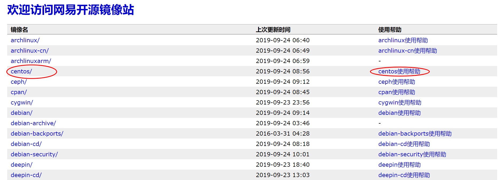
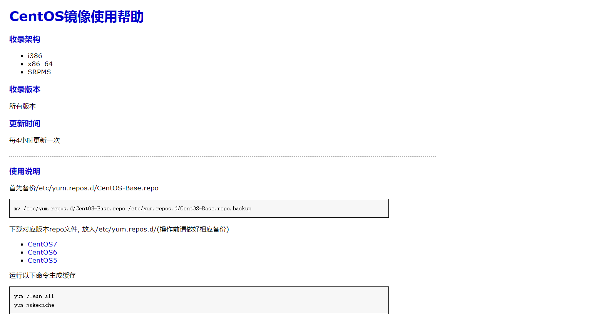
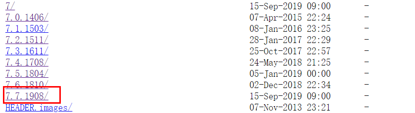

# Change Default Yum To CentOS Yum

- 更换RedHat Yum源为CentOS Yum 源

## 环境

- rhel-server-7.7-x86_64

## 更换 yum 源原因

RedHat自带yum源享受红帽公司的技术支持，同时也是要收费的。

如果你新安装了RedHat7，登录系统使用yum update更新系统时，会得到如下的提示：

```lan
This systemis not registered to Red Hat Subscription Management. You can usesubscription-manager to register.
```

> 因为 RedHat 默认自带的yum源需要注册，才能更新。

## 检查是否已安装yum源

可以用`rpm -qa |grep yum`命令来查看RHEL是否安装了`yum`，如果安装了，就会显示已安装哪些`yum`包：

```shell
[root@localhost ~]# rpm -qa | grep yum
yum-3.4.3-150.el7.centos.noarch
yum-langpacks-0.4.2-7.el7.noarch
yum-metadata-parser-1.1.4-10.el7.x86_64
yum-rhn-plugin-2.0.1-10.el7.noarch
PackageKit-yum-1.1.10-1.el7.centos.x86_64
```

## 卸载自带yum软件包

通过` rpm -e yum包 --nodeps` 进行自带yum软件包。

```shell
[root@localhost ~]# rpm -e yum-3.4.3-150.el7.centos.noarch --nodeps
[root@localhost ~]# rpm -e yum-utils-1.1.31-24.el7.noarch --nodeps
[root@localhost ~]# rpm -e yum-metadata-parser-1.1.4-10.el7.x86_64.rpm --nodeps
[root@localhost ~]# rpm -e yum-rhn-plugin-2.0.1-10.el7.noarch --nodeps
[root@localhost ~]# rpm -e PackageKit-yum-1.1.10-1.el7.centos.x86_64 --nodeps
[root@localhost ~]# rpm -e yum-langpacks-0.4.2-7.el7.noarch --nodeps
```

> 通过`rpm -qa | grep yum`检查自带yum包已全部卸载

## 下载新的yum源

可以在下网站查看对应的文件包；

**网易163网络源地址：**[http://mirrors.163.com/](http://mirrors.163.com/)
**CentOS 网络源地址：**[http://centos.ustc.edu.cn/centos/](http://centos.ustc.edu.cn/centos/)

- 下载安装包

```shell
   wget http://mirrors.163.com/centos/7/os/x86_64/Packages/yum-3.4.3-150.el7.centos.noarch.rpm
   wget http://mirrors.163.com/centos/7/os/x86_64/Packages/PackageKit-yum-1.1.10-1.el7.centos.x86_64.rpm
   wget http://mirrors.163.com/centos/7/os/x86_64/Packages/yum-plugin-fastestmirror-1.1.31-52.el7.noarch.rpm
   wget http://mirrors.163.com/centos/7/os/x86_64/Packages/yum-utils-1.1.31-52.el7.noarch.rpm
   wget http://mirrors.163.com/centos/7/os/x86_64/Packages/yum-rhn-plugin-2.0.1-10.el7.noarch.rpm
   wget http://mirrors.163.com/centos/7/os/x86_64/Packages/yum-metadata-parser-1.1.4-10.el7.x86_64.rpm
   wget http://mirrors.163.com/centos/7/os/x86_64/Packages/yum-langpacks-0.4.2-7.el7.noarch.rpm
   wget http://mirrors.163.com/centos/7/os/x86_64/Packages/yum-updateonboot-1.1.31-52.el7.noarch.rpm
```

## 安装yum

> rpm -ivh *.rpm

此时会有依赖包的问题，故此处可以加上下面两个参数强制安装：

> `--force` 即使覆盖属于其它包的文件也强迫安装

> `--nodeps` 如果该RPM包的安装依赖其它包，即使其它包没装，也强迫安装。

## 更改yum库的地址，这里使用如网易的CentOS镜像源

```shell
cd /etc/yum.repos.d/
wget http://mirrors.163.com/.help/CentOS6-Base-163.repo
```




> 将`CentOS6-Base-163.repo`中的`$releasever`换成当前有效版本号7.7.1908



> `shift+:`输入 `%s/$releasever/7.7.1908/g`

```p
# CentOS-Base.repo
#
# The mirror system uses the connecting IP address of the client and the
# update status of each mirror to pick mirrors that are updated to and
# geographically close to the client.  You should use this for CentOS updates
# unless you are manually picking other mirrors.
#
# If the mirrorlist= does not work for you, as a fall back you can try the 
# remarked out baseurl= line instead.
#
#
[base]
name=CentOS-7.7.1908 - Base - 163.com
#mirrorlist=http://mirrorlist.centos.org/?release=7.7.1908&arch=$basearch&repo=os
baseurl=http://mirrors.163.com/centos/7.7.1908/os/$basearch/
gpgcheck=1
gpgkey=http://mirrors.163.com/centos/RPM-GPG-KEY-CentOS-7

#released updates
[updates]
name=CentOS-7.7.1908 - Updates - 163.com
#mirrorlist=http://mirrorlist.centos.org/?release=7.7.1908&arch=$basearch&repo=updates
baseurl=http://mirrors.163.com/centos/7.7.1908/updates/$basearch/
gpgcheck=1
gpgkey=http://mirrors.163.com/centos/RPM-GPG-KEY-CentOS-7

#additional packages that may be useful
[extras]
name=CentOS-7.7.1908 - Extras - 163.com
#mirrorlist=http://mirrorlist.centos.org/?release=7.7.1908&arch=$basearch&repo=extras
baseurl=http://mirrors.163.com/centos/7.7.1908/extras/$basearch/
gpgcheck=1
gpgkey=http://mirrors.163.com/centos/RPM-GPG-KEY-CentOS-7

#additional packages that extend functionality of existing packages
[centosplus]
name=CentOS-7.7.1908 - Plus - 163.com
baseurl=http://mirrors.163.com/centos/7.7.1908/centosplus/$basearch/
gpgcheck=1
enabled=0
gpgkey=http://mirrors.163.com/centos/RPM-GPG-KEY-CentOS-7
```


## 设置生效

> `yum clean all` #清理yum缓存，使设置生效
> 
> `yum makecache` #将服务器上的软件包信息缓存到本地,以提高搜索安装软件的速度
> 
> `yum update` #更新
