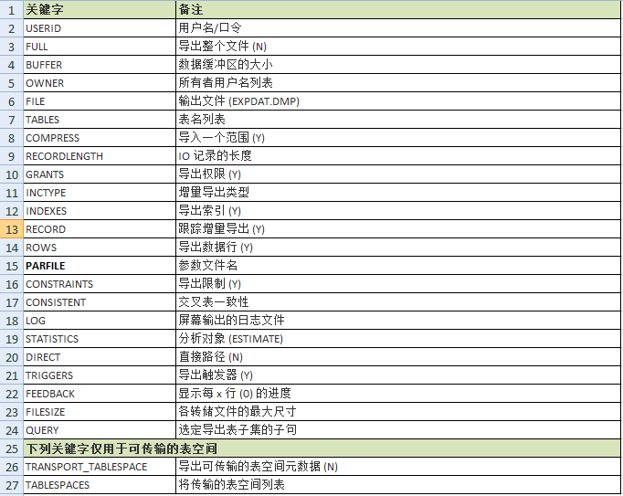
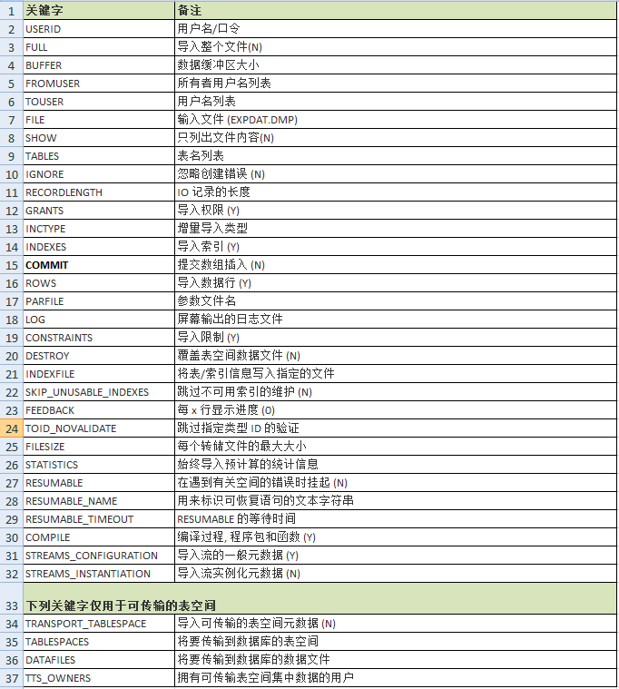

# 数据泵导入导出数据Impdp/Expdp

> 参考：
> [https://www.cnblogs.com/eastsea/archive/2014/09/11/3905092.html](https://www.cnblogs.com/eastsea/archive/2014/09/11/3905092.html)
> [https://segmentfault.com/a/1190000006704150](https://segmentfault.com/a/1190000006704150)

## exp/imp与expdp/impdp区别

1. 把用户`usera`的对象导到用户`userb`
  
   **用法区别在于`fromuser=usera touser=userb' ,`remap_schema='usera':'usera'**

    > imp system/passwd fromuser=usera touser=userb file=/oracle/exp.dmp log=/oracle/exp.log;
    > impdp system/passwd directory=expdp dumpfile=expdp.dmp remap_schema=’usera’:'userb’ logfile=/oracle/exp.log;

2. 更换表空间

   用`exp/imp`的时候，要想更改表所在的表空间，需要手工去处理一下，

    如`alter table xxx move tablespace_new`之类的操作。

    用`impdp`只要用`remap_tablespace='tabspace_old':'tablespace_new'`

3. 当指定一些表的时候，

   使用`exp/imp` 时，`tables`的用法是 `tables=('table1','table2','table3')`。

    `expdp/impdp`的用法是`tables='table1','table2','table3'`

4. 是否要导出数据行

    `exp`　（`ROWS=Y` 导出数据行，`ROWS=N` 不导出数据行）

    `expdp content`（`ALL`:对象＋导出数据行，`DATA_ONLY`：只导出对象，`METADATA_ONLY`：只导出数据的记录）

5. `expdp`是`[10g]`的新特性而且只能在服务器执行。而`exp/imp`是通用的。

6. `oracle11g`中有个新特性，当表无数据时，不分配`segment`，以节省空间,所以`exp`导不出空表。解决的办法是用`expdp`， 当然也可以设置`deferred_segment_creation` 参数 或者 `insert`一行，再`rollback`，但是这样很麻烦。

## dumpdir目录创建

```sql
以Linux系统为例
$ mkdir /home/oracle/dumpdir
#执行该命令之前，要首先在硬盘上创建'/home/oracle/dumpdir'数据库导入、导出所对应的文件夹
$ su - oracle  #切换到Oracle用户
$ sqlplus / as sysdba  #登录数据库控制台
SQL>create directory dumpdir as '/home/oracle/dumpdir';  #创建数据泵导入、导出目录
SQL>select * from dba_directories;  #查看一下是否已存在该目录
-------------------------------------------------------------------------------
SYS                            DUMPDIR
/home/oracle/dumpdir

SQL>grant read,write on directory dumpdir to dbname;
#授权给操作用户这个dump目录的权限【dbname是一个已经存在的数据库用户】
SQl>exit
```

## 导出数据

### 导出expdb的过程

1. 按用户导

   ```sql
   expdp scott/tiger@orcl schemas=scott dumpfile=expdp.dmp DIRECTORY=dpdata1;
   ```

2. 并行进程parallel

   ```sql
   expdp scott/tiger@orcl directory=dpdata1 dumpfile=scott3.dmp parallel=40 job_name=scott3
   ```

3. 按表名导

   ```sql
   expdp scott/tiger@orcl TABLES=emp,dept dumpfile=expdp.dmp DIRECTORY=dpdata1;
   ```

4. 按查询条件导

   ```sql
   expdp scott/tiger@orcl directory=dpdata1 dumpfile=expdp.dmp Tables=emp query='WHERE deptno=20';
   ```

5. 按表空间导

   ```sql
   expdp system/manager DIRECTORY=dpdata1 DUMPFILE=tablespace.dmp TABLESPACES=temp,example;
   ```

6. 导整个数据库

   ```sql
   expdp system/manager DIRECTORY=dpdata1 DUMPFILE=full.dmp FULL=y;
   ```

### 参数说明 - 导出expdb

(1). CONTENT：该选项用于指定要导出的内容.默认值为ALL

      CONTENT={ALL | DATA_ONLY | METADATA_ONLY}

      当设置CONTENT为ALL 时,将导出对象定义及其所有数据.为DATA_ONLY时,只导出对象数据,为METADATA_ONLY时,只导出对象定义

(2). DIRECTORY：指定转储文件和日志文件所在的目录：DIRECTORY=directory_object

(3). EXCLUDE：该选项用于指定执行操作时释放要排除对象类型或相关对象

      EXCLUDE=object_type[:name_clause] [,….]

      Object_type用于指定要排除的对象类型,name_clause用于指定要排除的具体对象.EXCLUDE和INCLUDE不能同时使用

      Expdp scott/tiger DIRECTORY=dump DUMPFILE=a.dup EXCLUDE=VIEW

(4). INCLUDE：导出时包含指定的类型

        (例:INCLUDE=TABLE_DATA,

             INCLUDE=TABLE:"LIKE 'TAB%'"

             INCLUDE=TABLE:”NOT LIKE ‘TAB%’”…)

             EXCLUDE:导出时排除的数据类型(例:EXCLUDE=TABLE:EMP)

(5). FILESIZE：指定导出文件的最大尺寸,默认为0,(表示文件尺寸没有限制)(单位为bytes).

(6). JOB_NAME：此次导出进程使用的名称,方便跟踪查询(可选)

(7). FLASHBACK_SCN：指定导出特定SCN时刻的表数据

       FLASHBACK_SCN=scn_value：Scn_value用于标识SCN值.FLASHBACK_SCN和FLASHBACK_TIME不能同时使用

       Expdp scott/tiger DIRECTORY=dump DUMPFILE=a.dmp

       FLASHBACK_SCN=358523

(8). FLASHBACK_TIME：指定导出特定时间点的表数据：FLASHBACK_TIME=“TO_TIMESTAMP(time_value)”

       Expdp scott/tiger DIRECTORY=dump DUMPFILE=a.dmp FLASHBACK_TIME=“TO_TIMESTAMP(’25-08-2004 14:35:00’,’DD-MM-YYYY HH24:MI:SS’)”

(9). TABLESPACE：指定一个表空间导出.

(10). QUERY=[schema.] [table_name:] query_clause

        Schema用于指定方案名,table_name用于指定表名,query_clause用于指定条件限制子句.QUERY选项不能与 CONNECT=METADATA_ONLY,EXTIMATE_ONLY,TRANSPORT_TABLESPACES等选项同时使用.

        Expdp scott/tiger directory=dump dumpfiel=a.dmp Tables=emp query=’WHERE deptno=20’

(11). PARALLEL：并行操作： 指定执行导出操作的并行进程个数,默认值为1



## 还原数据

### .导入impdp的过程

(1). 导到指定用户下

        impdp scott/tiger DIRECTORY=dpdata1 DUMPFILE=expdp.dmp SCHEMAS=scott;

(2). 改变表的owner

        impdp system/manager DIRECTORY=dpdata1 DUMPFILE=expdp.dmp TABLES=scott.dept REMAP_SCHEMA=scott:system TABLE_EXISTS_ACTION=TRUNCATE;

(3). 导入表空间

        impdp system/manager DIRECTORY=dpdata1 DUMPFILE=tablespace.dmp TABLESPACES=example;

(4). 导入数据库

        impdb system/manager DIRECTORY=dump_dir DUMPFILE=full.dmp FULL=y;

(5). 追加数据

        impdp system/manager DIRECTORY=dpdata1 DUMPFILE=expdp.dmp SCHEMAS=system TABLE_EXISTS_ACTION

### 参数说明 - 导入impdp

(1). TABBLE_EXISTS_ACTION={SKIP | APPEND | TRUNCATE | FRPLACE }

当设置该选项为SKIP时，导入作业会跳过已存在表处理下一个对象；

当设置为APPEND时，会追加数据；

当设置为TRUNCATE时，导入作业会截断表,然后为其追加新数据；

当设置为REPLACE时，导入作业会删除已存在表,重建表病追加数据；

注意，TRUNCATE选项不适用与簇表和NETWORK_LINK选项；

(2). REMAP_SCHEMA

该选项用于将源方案的所有对象装载到目标方案中：REMAP_SCHEMA=source_schema:target_schema

(3). REMAP_TABLESPACE

将源表空间的所有对象导入到目标表空间中：REMAP_TABLESPACE=source_tablespace:target:tablespace

(4). REMAP_DATAFILE

该选项用于将源数据文件名转变为目标数据文件名,在不同平台之间搬移表空间时可能需要该选项.

REMAP_DATAFIEL=source_datafie:target_datafile

